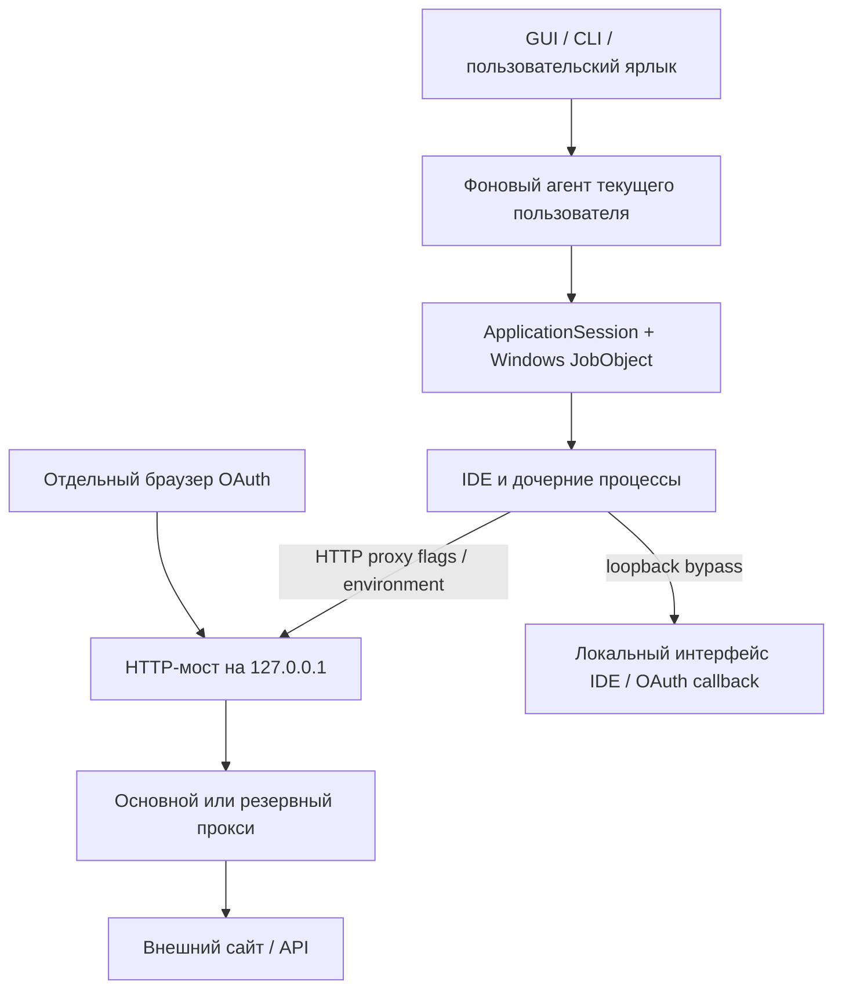

# DevProxy 2.3.8

**Прокси для выбранных IDE и инструментов Windows: русский интерфейс, профили, постоянный запуск через ярлыки, фоновый агент и трей.**

DevProxy поднимает локальный HTTP-мост и запускает приложение с proxy flags и переменными окружения. Мост передаёт соединения через сохранённый HTTP, HTTPS или SOCKS5-прокси. Поддерживаются авторизация, резервные серверы и отдельный браузер входа Antigravity. Выпуск 2.3.8 включает восстановление локального окна Antigravity после временного тайм-аута и понятный статус постоянного режима.

[Скачать Windows x64](https://github.com/j46871417-ui/devproxy/releases/tag/v2.3.8) · [История изменений](CHANGELOG.md) · [Матрица поддержки](MATRIX.md) · [Отчёт проверки](REPORT.md)

> **Граница возможностей:** DevProxy передаёт настройки приложениям, но не перехватывает произвольный трафик через WFP/TUN. Приложение или его компонент, игнорирующий эти настройки, может подключаться напрямую. Сам локальный мост при отказе прокси никогда не подключается к внешнему назначению напрямую. Обнаружение IDE не означает, что проверен каждый её сетевой компонент.

## Быстрый старт

1. Скачайте `devproxy-windows-x64.zip` из Releases и распакуйте в постоянную папку. Python для готовых EXE не нужен.
2. Запустите `devproxy-gui.exe`. При первом запуске выполняется поиск установленных приложений; список можно обновить или дополнить вручную.
3. Добавьте профиль: протокол, адрес, порт и, если нужны, логин и пароль. Поля поддерживают вставку, копирование и контекстное меню. Адрес примера: `https://proxy.example.net:8443` — замените его параметрами своего сервера.
4. Выберите профиль, отметьте приложение и запустите его через DevProxy. Полностью закройте прежний экземпляр IDE перед первым запуском с прокси: иначе новый процесс может передать управление старому.
5. Для обычного запуска из Пуска/с рабочего стола включите постоянный режим для выбранного приложения.

Доступ к внешним сайтам определяют сервер, его белый список и доступность самого сервиса. Успешное соединение с одним адресом не подтверждает доступность всех API, моделей или OAuth.

## Постоянный режим: что именно включено

Постоянный режим — **сохранённое правило «приложение → профиль прокси»**, перенастроенные пользовательские ярлыки и автозапуск фонового агента при входе в Windows. Это агент текущего пользователя, для него не требуется установка системной службы.

| Элемент интерфейса | Значение |
| --- | --- |
| «Постоянный режим ВКЛЮЧЁН» | Есть сохранённые правила; рядом показаны приложения и назначенные профили |
| «ВЫКЛЮЧЕН» | Сохранённых правил нет |
| «СТАТУС НЕДОСТУПЕН» | Правила не удалось прочитать; последний известный снимок не выдаётся за актуальный |
| Состояние моста | Отдельно показывает работающий агент/туннели и ошибки соединений |
| Автозапуск | Отдельно показывает настройку запуска при входе пользователя |
| Галочки приложений | Выбор для следующего действия; снятие галочки само по себе правило не отменяет |
| Выбранный профиль | Профиль для следующего действия; существующие правила меняются только после применения |

Кнопка **«Что это значит?»** объясняет режим прямо в программе. Профиль каждого приложения также показан в таблице. Включённое правило не является индикатором доступности интернета.

При включении DevProxy перенастраивает подходящие пользовательские ярлыки рабочего стола, Пуска и закрепления панели задач. Если подходящего ярлыка нет, создаётся ярлык в **Пуск → DevProxy**. Ярлык вызывает DevProxy с идентификатором приложения; агент при необходимости запускается автоматически, затем запускает исходный EXE с нужным окружением. Аргументы, рабочая папка и значок сохраняются.

**Крестик и сворачивание прячут окно в трей**, соединения остаются активными. Через значок можно открыть настройки, запустить приложение, отключить режим или выйти. **«Выход — остановить приложения»** завершает агент и управляемые им процессы; сохранённые правила остаются для следующего запуска.

Для отмены выберите приложение и нажмите **«Вернуть обычный запуск»**, затем перезапустите приложение. Исходные ярлыки восстанавливаются по журналу; чужие изменения не затираются. После отключения последнего правила восстанавливается предыдущая запись автозапуска.

Правила действуют через перенастроенные ярлыки. Прямой запуск исходного EXE, файловые ассоциации, другие пользователи Windows и общие ярлыки автоматически не перехватываются. Не перемещайте EXE DevProxy после настройки: сначала отмените правила, затем включите их из новой папки.

## Архитектура и движение трафика



1. `ApplicationSession` проверяет профиль и путь исполняемого файла, создаёт локальный мост и готовит настройки адаптера.
2. Приложение получает credential-free адрес вида `http://127.0.0.1:<порт>`. Пароль upstream-прокси не передаётся приложению в аргументах.
3. Мост читает актуальную конфигурацию и секрет при открытии каждого нового соединения, устанавливает соединение с upstream и передаёт поток в обоих направлениях.
4. Windows JobObject управляет временем жизни запущенного процесса и потомков. Он закрывает их при остановке сессии/агента, но **не фильтрует сетевые пакеты**. Уже работающие чужие экземпляры приложения не относятся к этой сессии.

Для proxy-aware приложений задаются `HTTP_PROXY`, `HTTPS_PROXY`, `ALL_PROXY` и варианты в нижнем регистре. Electron получает также `--proxy-server`, `--proxy-bypass-list=localhost;127.0.0.1;[::1]` и `--disable-quic`. `NO_PROXY`/`no_proxy` оставляют loopback доступным для внутренних серверов и возврата OAuth. Проверка TLS в Node остаётся включённой.

Antigravity и постоянные запуски Electron используют существующий профиль приложения, сохраняя авторизацию и настройки. Для обычных временных сессий других Electron IDE используется отдельный временный профиль. Приложения запускаются через настоящий EXE/Node entrypoint без `shell=True`; несовместимые дополнительные proxy/profile/security flags отклоняются.

### Протоколы и транспорт

| Upstream | Реализация |
| --- | --- |
| HTTP | Forward HTTP и CONNECT; Basic-аутентификация прокси при наличии учётных данных |
| HTTPS | Те же запросы внутри TLS к серверу прокси; штатная проверка сертификата и имени сервера |
| SOCKS5 | Username/password authentication, адреса IPv4/IPv6 и передача имени назначения прокси для remote DNS |

Для HTTPS-назначений CONNECT передаёт поток без подмены сертификатов и без расшифровки прикладного TLS мостом. DevProxy не устанавливает свой CA и не отключает проверку сертификатов. Локальный мост слушает loopback; у него нет отдельной клиентской аутентификации, поэтому другие локальные процессы могут использовать его, пока он активен.

Пределы текущего моста: до 64 соединений, handshake budget 10 секунд, idle timeout 120 секунд, блок чтения 32 КиБ и буфер до 64 КиБ на направление. Передача учитывает `SSLWantRead`/`SSLWantWrite` и обратное давление. На TLS-сокете не выполняется разрушающее SSL-слой полузакрытие.

К одному HTTPS upstream одновременно выполняются максимум два TLS-рукопожатия; уже открытые потоки работают параллельно. Допускается до трёх попыток только при раннем EOF/разрыве первоначального handshake, в пределах общего deadline и до CONNECT. Ошибки сертификатов, неверный протокол, HTTP 403/407 и уже отправленные прикладные запросы не повторяются таким способом.

Диагностика хранит до 16 ошибок назначений и 32 событий истории. Успех одного адреса не стирает ошибку другого. Сообщения различают этап, назначение, тип TLS-ошибки, код и HTTP-статус; секреты и полные OAuth URL в них не выводятся.

## Профили и резервные серверы

Профиль имеет постоянный `profile_id`, отображаемое имя, схему, host/port, username и ссылку на секрет. Переименование сохраняет идентичность, постоянные правила и зарезервированный локальный порт. Удаление и создание профиля с тем же именем не присоединяет старую сессию к новым секретам автоматически.

Метаданные и пароль читаются согласованно под блокировкой состояния перед **новым соединением**. Изменение адреса/порта/пароля применяется к следующим соединениям работающего моста; уже открытые потоки продолжают работать. Недоступный профиль или пароль вызывает отказ, без прямого подключения и без скрытого перехода к соединению без авторизации.

Через **«Резервные прокси…»** можно назначить основному профилю до четырёх резервов — всего пять серверов. Это альтернативные выходы, а не цепочка из пяти узлов. Адреса и учётные данные нужно добавить самостоятельно; серверы DevProxy не предоставляет и не настраивает.

Переключение разрешено только при транспортном сбое TCP/TLS к самому прокси **до CONNECT**. Выбранный выход сохраняется для текущей сессии. Отказ назначения, белого списка, аутентификации, сертификата или прикладного протокола не используется для обхода через другой сервер. Недоступный маршрут получает ограниченную паузу перед повтором; общий timeout не растёт на каждый резерв. Потоки с уже отправленными данными не воспроизводятся.

Во время браузерного входа Antigravity текущий выход закрепляется до завершения сессии, чтобы IDE и браузер использовали один маршрут. Если он недоступен, пользователь получает ошибку, а страна выхода не меняется посреди OAuth.

## Вход Antigravity через прокси

1. Начните вход в самом Antigravity, чтобы клиент создал новую OAuth-ссылку и локальный callback.
2. В DevProxy нажмите **«Вход Antigravity через прокси…»**. Свежая ссылка из ограниченного хвоста локального журнала может подставиться автоматически; её можно вставить вручную.
3. DevProxy проверит профиль, фактический CONNECT и TLS к `accounts.google.com`, а также доступность loopback callback, если он есть в ссылке.
4. Откроется отдельный профиль Chrome, Edge, Brave или Яндекс Браузера через тот же мост. Системные настройки и основной профиль браузера не меняются.
5. При `localhost` callback вход возвращается в Antigravity автоматически. Код следует вставлять вручную только если его запрашивает сам клиент.

Принимаются HTTPS-ссылки разрешённых Google/Antigravity login hosts; устаревшая ссылка с уже закрытым callback отклоняется. Транспортная проверка не отправляет OAuth `state`, PKCE или authorization code. Полный URL входа не записывается в состояние или технические логи DevProxy. Пользователь завершает вход в браузере самостоятельно.

`ERR_TUNNEL_CONNECTION_FAILED` означает проблему установления туннеля, а не повод очищать профиль Antigravity. Проверьте профиль, пароль, реальное назначение и разрешения upstream. Повторно получите свежую ссылку, если предыдущая сессия входа уже закрыта.

## Восстановление чёрного окна Antigravity в 2.3.7

У установленного самостоятельного клиента наблюдалась ошибка загрузки собственной страницы `https://127.0.0.1:<динамический порт>/`: примерно через 30 секунд возникал `ERR_TIMED_OUT`, окно оставалось пустым. Loopback шёл напрямую, внешний прокси не участвовал в этой навигации.

DevProxy перед запуском совместимого Antigravity добавляет обработчик восстановления в `resources/app.asar`, запись `dist/utils.js`:

- только основной фрейм и корневая страница `https://127.0.0.1:<порт>/`;
- только ошибки `-7`, `-100`, `-101`, `-102`: максимум два повтора с задержкой 750 мс;
- успешная навигация с HTTP 200 сбрасывает бюджет; загрузка страницы ошибки его не сбрасывает;
- закрытие окна или переход на другой адрес отменяет ожидающий повтор;
- внешние страницы, OAuth, ошибки сертификатов и отменённые навигации не повторяются;
- после исчерпания попыток показывается сообщение с ручным повтором.

Механизм проверяет структуру архива, известные участки JS и настройки embedded ASAR integrity до записи. При включённой встроенной проверке целостности или неизвестном формате изменение отклоняется; защитные fuses не переключаются. Остальные packed/unpacked записи сохраняются, целостность изменённой записи пересчитывается. Запись атомарная, с блокировкой между процессами. Первая модификация требует закрытого Antigravity.

Рядом создаются исходный `app.asar.devproxy-recovery-<hash>.bak`, журнал `app.asar.devproxy-recovery.json` с SHA256 и файл блокировки. Повторное применение идемпотентно. Архив клиента, аккаунт и эти резервные копии не входят в дистрибутив DevProxy.

Для ручного восстановления исходного архива **полностью закройте Antigravity**:

```powershell
.\devproxy.exe antigravity-recovery "C:\Path\To\Antigravity.exe" --restore
```

Откат разрешён только при совпадении SHA256 изменённого архива и исходной копии. После обновления клиента или чужого изменения операция отказывает вместо перезаписи. Старые не-ASAR варианты не требуют этого исправления; новая неизвестная сборка может потребовать обновления механизма. При следующем совместимом запуске через DevProxy исправление снова применяется.

На живом запуске 2.3.7 первая навигация завершилась ошибкой `-7` за **30 105 мс**, автоматическая попытка **1/2** получила HTTP 200 за **187 мс**, интерфейс загрузился. **Причина первоначальной задержки остаётся неустановленной.** Исправление восстанавливает окно после временного отказа, но не устраняет блокировку внешних API. Подробности: [локальный отчёт 2.3.7](docs/LOCAL_2.3.7_VERIFICATION.md).

## Обнаружение и поддержка приложений

Каталог включает Antigravity, VS Code/Insiders/VSCodium, Cursor, Windsurf, Visual Studio, IDE JetBrains, Android Studio, Zed, Sublime Text, Notepad++, Codex CLI/Desktop, OpenCode, Claude Code и Git. Поиск использует стандартные каталоги, PATH, реестр App Paths/Uninstall, пользовательские ярлыки, MSIX, Toolbox и известные Node/npm entrypoints. Полное сканирование диска и установка найденных программ не выполняются.

Адаптер описывает способ обнаружения и запуска. Electron-приложения получают Chromium proxy flags плюс environment; CLI и прочие EXE — настройки окружения, которые конкретная программа должна поддерживать. Некоторые расширения, updater, собственный HTTP-клиент или внешний браузер могут иметь независимую сетевую конфигурацию. Список найденных приложений не является сертификатом полного проксирования. Проверяйте необходимые сценарии конкретной IDE.

## CLI

Готовый CLI — `devproxy.exe`; из исходников те же команды доступны через `python devproxy.py`. Для актуальных параметров используйте `--help` и справку подкоманды.

```powershell
.\devproxy.exe --version
.\devproxy.exe gui
.\devproxy.exe apps list
.\devproxy.exe profile add https://proxy.example.net:8443 --name work --username alice
.\devproxy.exe profile list
.\devproxy.exe doctor --profile work --target accounts.google.com --port 443
.\devproxy.exe run antigravity --profile work
.\devproxy.exe run "C:\Tools\mytool.exe" --profile work
.\devproxy.exe status
```

Пароль запрашивается скрытым вводом. Не помещайте его в URL или аргументы: CLI отклоняет inline credentials. `--proxy` допускает временный адрес без учётных данных. Дополнительные аргументы приложения передаются после `--`.

| Команда | Назначение |
| --- | --- |
| `profile add / list / remove` | Сохранить, перечислить или удалить профиль |
| `apps list` | Обнаружить приложения |
| `doctor` / `test` | Проверить транспорт до заданного назначения; по умолчанию `github.com:443` |
| `doctor --echo` | Дополнительно запросить `https://cloudflare.com/cdn-cgi/trace` через мост; это явная внешняя проверка |
| `run ... --dry-run` | Показать безопасные параметры запуска без запуска приложения |
| `run ... --require-fail-closed` | Запросить принудительную изоляцию; текущий backend явно отказывает, поскольку WFP не реализован |
| `status` | Показать сохранённое состояние |
| `antigravity-recovery PATH [--restore]` | Применить или отменить совместимое восстановление локального окна |

Старые `apply`/`restore --app` относятся к прежнему механизму изменения конфигураций. `apply` направляет в GUI; для отключения текущих постоянных правил используйте **«Вернуть обычный запуск»**, а не legacy restore.

## Состояние, секреты и IPC

По умолчанию состояние находится в `%USERPROFILE%\.devproxy`; для отдельного экземпляра/тестов можно задать `DEVPROXY_STATE_DIR`.

| Данные | Место и поведение |
| --- | --- |
| `state.json` | Метаданные профилей, IDs, username, обнаруженные приложения, route groups, правила, локальные порты, автозапуск и журнал ярлыков; без паролей |
| Пароль прокси | Windows Credential Manager, отдельная ссылка на секрет; при недоступности постоянного хранилища сохранение отказывает |
| `agent.key` | Случайный 32-байтный ключ аутентификации локального IPC; это секрет, его нельзя публиковать |
| `oauth-browser/<hash>` | Отдельные профили браузерного входа; могут содержать cookies, их нельзя публиковать |
| ASAR backup/journal | Рядом с установленным Antigravity, отдельно от состояния DevProxy |

Состояние обновляется через временный файл, fsync и атомарную замену под внутрипроцессной и межпроцессной блокировкой. Пароли не сохраняются в JSON, shortcut targets или proxy URL приложения. Windows Credential Manager обслуживается через Win32 API; plaintext fallback для постоянных профилей не используется.

GUI и запускающий ярлык общаются с агентом через named pipe `\\.\pipe\DevProxy-<hash пути состояния>`. Используется аутентификация ключом и ограниченные JSON-сообщения до 64 КиБ; пользовательский payload не десериализуется через pickle. Отдельной политики сетевой изоляции IPC не создаёт. Сохраняйте обычные ограничения доступа к каталогу пользователя и не передавайте `agent.key` другим пользователям.

Автозапуск хранится в `HKCU\Software\Microsoft\Windows\CurrentVersion\Run`, значение `DevProxy`. Предыдущее значение и исходные ярлыки учитываются при откате, конфликтующие сторонние изменения сохраняются. Глобальные системные proxy settings не переключаются.

Перед удалением программы отключите постоянные правила из GUI, при необходимости отмените ASAR-изменение с проверенным backup и завершите агент. Удаление каталога состояния само по себе не восстанавливает ярлыки и не отменяет изменения клиента; сначала выполните штатный откат.

## Структура исходников

| Путь | Ответственность |
| --- | --- |
| `devproxy.py`, `devproxy_gui.py` | Точки входа CLI и GUI |
| `devproxy_pkg/ui.py`, `ui_editing.py`, `windows_tray.py` | Русский интерфейс, редактирование полей, статус и трей |
| `devproxy_pkg/discovery.py`, `adapters/` | Каталог, обнаружение, спецификации запуска |
| `core/launcher.py`, `windows_job.py` | Сессия приложения и дерево процессов |
| `core/tunnel.py`, `transport.py` | Локальный HTTP-мост, upstream HTTP/HTTPS/SOCKS5 и relay |
| `cli.py`, `core/profiles.py`, `profile.py` | Команды, стабильные IDs, сохранение и выбор маршрута |
| `core/background.py`, `agent_ipc.py`, `shortcuts.py` | Постоянные правила, агент, IPC, автозапуск и откат ярлыков |
| `core/recovery.py`, `secrets.py` | Атомарное состояние и Windows Credential Manager |
| `core/oauth_browser.py` | Проверка ссылки и браузер входа через выбранный мост |
| `core/antigravity_recovery.py` | Ограниченное восстановление локального окна и ASAR-откат |
| `core/diagnostics.py`, `user_errors.py`, `validator.py` | Проверки транспорта, классификация и безопасные сообщения |
| `resources/*.ps1` | Обнаружение Windows и операции с ярлыками |
| `tests/`, `tools/build_windows.py` | Регрессии, сборка и проверки готовых EXE |
| `.github/workflows/windows.yml` | Windows CI и выпуск по тегу версии |

## Разработка, сборка и выпуск

Основная платформа выпуска — **Windows x64**. Код требует Python 3.11+, сборка выпуска использует Python 3.14. GUI использует Tk/Tkinter; runtime-логика использует стандартную библиотеку Python и Windows API. Для упаковки закреплён `PyInstaller 6.20.0`. Node.js используется для исполнения JS-регрессии восстановления; при его отсутствии этот тест пропускается, поэтому для полной проверки установите Node.js.

```powershell
git clone https://github.com/j46871417-ui/devproxy.git
cd devproxy
py -3.14 -m venv .venv
.\.venv\Scripts\python.exe -m pip install -r requirements-build.txt
.\.venv\Scripts\python.exe -m unittest discover -s tests -v
.\.venv\Scripts\python.exe tools/build_windows.py
```

Build gate выполняет compileall, полный unittest discover, собирает консольный и оконный onefile EXE, проверяет CLI help и запуск Tk из обоих готовых бинарников, затем формирует ZIP и SHA256SUMS. Для Tcl/Tk 9 из Python 3.14 предусмотрена упаковка ресурсов zipfs. `DEVPROXY_BUILD_DIR` позволяет выбрать другой каталог результата внутри проекта.

Windows CI запускается на push/PR. При теге `v<версия пакета>` выпуск публикуется **после успешного Windows build gate**; несовпадение тега и версии отклоняется. В GitHub Releases находятся:

- `devproxy-gui.exe` — GUI и агент;
- `devproxy.exe` — CLI;
- `devproxy-windows-x64.zip` — оба EXE, README, MATRIX, REPORT и LICENSE;
- `SHA256SUMS.txt` — контрольные суммы трёх артефактов.

Исполняемые файлы пока не подписаны сертификатом издателя. Сверить загруженный ZIP можно командой `(Get-FileHash .\devproxy-windows-x64.zip -Algorithm SHA256).Hash` с соответствующей строкой `SHA256SUMS.txt`. Архив не содержит профилей, паролей, cookies, приватных логов, резервных копий или файлов установленного Antigravity.

## Что проверено и что ограничено

После исправления CI-регрессии в 2.3.8 полный локальный набор снова прошёл: **203 теста, OK**.

В 2.3.8 исправлена переносимость регрессии отказа атомарной записи: пути сравниваются после нормализации, тест принудительно использует неканоническое написание пути. Рабочая логика установленной 2.3.7 сохранена. Тег 2.3.7 остался в истории; его Windows CI остановился на этой тестовой ошибке, готовый GitHub-релиз по нему не выпускался.

Для 2.3.7 локально прошли **203 автоматических теста**, Windows build gate и smoke checks готовых CLI/GUI. Проверены транспорт HTTP/HTTPS/SOCKS5, целостность TLS relay, профили и миграции, откат ярлыков/автозапуска, IPC, резервные маршруты, preflight OAuth, статус режима и 13 регрессий восстановления Antigravity. На установленном клиенте подтверждено автоматическое восстановление после настоящего loopback timeout; 8 октября пользователь подтвердил рабочее состояние и разрешил выпуск.

Это не универсальная проверка всех IDE, всех внешних моделей/API или нового OAuth при отключённом VPN. Начальные TLS-обрывы к upstream наблюдались; они обрабатываются в описанных пределах. DevProxy не обходит серверный белый список и не может исправить отказ назначения, аккаунта или сервиса.

Нет WFP backend, TUN/VPN, UDP-проксирования, системной службы, балансировки отдельных запросов и автоматического развёртывания серверной инфраструктуры. Строгая блокировка всех прямых подключений требует отдельного реализованного backend; текущий `--require-fail-closed` отказывает явно. Linux/macOS не являются поддерживаемыми платформами готового выпуска.

## Лицензия

[MIT](LICENSE). Дистрибутив содержит DevProxy, а не сторонние IDE. Совместимое изменение Antigravity выполняется локально с резервной копией; архив клиента и его учётные данные не распространяются.
